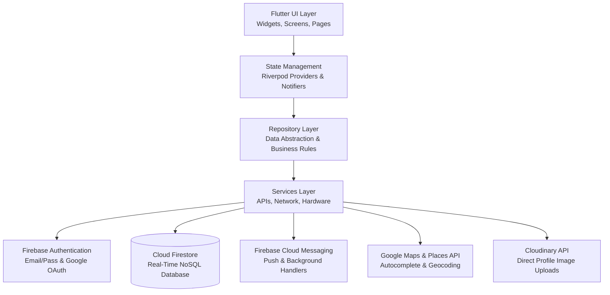

# 🚗 AutoShare — Modern Campus & City Ride-Sharing Platform

[](https://flutter.dev/)
[](https://dart.dev/)
[](https://firebase.google.com/)
[](https://developers.google.com/maps)
[](https://riverpod.dev/)
[](https://cloudinary.com/)

AutoShare is a full-featured, cross-platform ride-sharing mobile application built with **Flutter**, **Firebase**, and **Google Maps Platform**. Designed specifically for universities, colleges, and urban commuters, AutoShare connects vehicle owners with empty seats to commuters traveling along the same route. 

It introduces a **dynamic cost-sharing algorithm** (fares automatically reduce as more passengers join), a **Women-Only rides filter**, **real-time in-app chat**, **live push notifications**, and **interactive map route discovery**.

---

## 📌 Table of Contents
1. [🌟 Executive Summary & Problem Solved](#-executive-summary--problem-solved)
2. [🏗️ High-Level System Architecture](#️-high-level-system-architecture)
3. [🛠️ Tech Stack & Dependencies](#️-tech-stack--dependencies)
4. [⚡ Key Features & Functionality](#-key-features--functionality)
5. [🔌 APIs & Third-Party Integrations](#-apis--third-party-integrations)
6. [🗄️ Database Schema & Data Models](#️-database-schema--data-models)
7. [📁 Project Folder Structure](#-project-folder-structure)
8. [🚀 Setup & Installation Guide](#-setup--installation-guide)
9. [🎤 Presentation & Pitch Walkthrough](#-presentation--pitch-walkthrough)
10. [🔮 Future Roadmap](#-future-roadmap)

---

## 🌟 Executive Summary & Problem Solved

### The Problem
- **High Daily Commute Costs**: Students and professionals spend substantial money on private cabs, auto-rickshaws, or fuel for solo driving.
- **Wasted Fuel & Traffic Congestion**: Thousands of vehicles travel with 2–3 empty seats on identical routes every day.
- **Safety Concerns**: Random carpooling lacks accountability, verified profiles, and gender-specific safety filters.
- **High Commission Ride-Hailing**: Existing commercial taxi apps take 25–30% commissions, driving costs up for passengers while reducing driver earnings.

### The AutoShare Solution
- **Dynamic Cost Splitting**: A fair mathematical model where total trip cost is divided equally among driver and co-riders:  
  $$\text{Fare Per Person} = \frac{\text{Total Trip Fare}}{1 + \text{Accepted Passengers}}$$
  *The more people join, the cheaper the trip becomes for everyone!*
- **Zero Commission**: Direct peer-to-peer ridesharing without platform fees.
- **Women-Only Safe Rides**: Verified female riders and drivers can filter rides exclusively for women.
- **Real-Time Booking & In-App Chat**: Live driver request notifications, instant acceptance/rejection, and synchronized chat before departure.
- **Turn-by-Turn Map Integration**: Interactive pickup/drop location picker with live Google Maps markers and reverse geocoding.

---

## 🏗️ High-Level System Architecture

AutoShare follows a **Feature-First Clean Architecture** with **Riverpod** for reactive state management and dependency injection.



---

## 🛠️ Tech Stack & Dependencies

| Layer | Technology | Details |
| :--- | :--- | :--- |
| **Framework** | **Flutter 3.x** | Multiplatform framework (Android, iOS, Web) |
| **Language** | **Dart 3.x** | Sound null-safety, async streams, modern patterns |
| **State Management** | **Flutter Riverpod 3.3.2** | Compile-safe state management (`Notifier`, `Provider.family`, `AsyncValue`) |
| **Navigation & Routing** | **GoRouter 17.3.0** | Declarative routing, deep links, route guards & redirection |
| **Authentication** | **Firebase Auth 6.7.0** + **Google Sign-In 6.2.1** | Email/Password, Email Verification, Google OAuth with DB existence checks |
| **Database** | **Cloud Firestore 6.10.0** | Serverless real-time NoSQL document store with live streams |
| **Push Notifications** | **Firebase Messaging 16.7.0** + **Flutter Local Notifications 22.2.0** | Push notifications, foreground heads-up banners & background handlers |
| **Location & Maps** | **Google Maps Flutter 2.18.1** + **Geolocator 14.0.3** | Interactive maps, device GPS tracking, Google Places autocomplete |
| **Media Storage** | **Cloudinary REST API** + **Image Picker 1.2.3** | Direct unsigned CDN upload for profile pictures & avatars |
| **Typography & UI** | **Google Fonts 8.2.0** (`Inter`, `Outfit`) | Modern typography, Material Design 3, custom optical alignment |
| **Analytics & Crashlytics**| **Firebase Analytics 12.6.0** + **Crashlytics 5.4.0** | Performance monitoring, event tracking, crash diagnosis |
| **Offline Geocoding** | **LocationService (Hybrid Engine)** | Built-in Gujarat/India landmark dataset + OpenStreetMap fallback |

---

## ⚡ Key Features & Functionality

### 1. 🔐 Authentication & Onboarding
- **Email & Password Authentication**: Complete signup and login with strict validation (RFC-compliant email, secure password).
- **Mandatory Email Verification**: Guarded routing prevents unverified users from accessing home features until verified via email link.
- **Google Sign-In with Database Guard**:
  - Automatically verifies if the Google email exists in Firestore.
  - If a **new user** taps *Continue with Google* on Login, the system cleanly signs them out and redirects them to the **Create Account** page with a helpful prompt (*"Account not found. Please create an account to get started"*).
  - Once registered, subsequent logins seamlessly grant access.
- **Profile Completion**: First-time setup for gender, mobile number, and avatar upload.
- **Mobile Number Uniqueness**: Server-side uniqueness query ensures no two accounts share a contact number.
- **Forgot Password**: Password reset email dispatch.

### 2. 🏠 Smart Home Dashboard
- **Quick Search Pill Bar**: Symmetrically aligned date picker ("Today") and passenger seat selector ("2 Seats") with pixel-perfect optical alignment.
- **Campus Route Shortcuts**: One-tap quick actions for frequent destinations.
- **Women-Only Filter Switch**: Instant toggle filtering home recommendations for female riders.
- **Live User Profile Pill**: Displays current user greeting, photo, and notification badge counter.

### 3. 🔍 Ride Search & Interactive Map Discovery
- **Hybrid Address Autocomplete**: Google Places Autocomplete backed by an offline-cached campus dataset for instant address predictions.
- **Interactive Map Location Picker**: Interactive Google Map with a draggable target pin and live reverse geocoding to pick exact pickup/drop-off spots.
- **Multidimensional Filtering**: Filter by Departure Date, Time, Required Seats (1 or 2), Max Fare Slider (₹50 to ₹1000+), and Women-Only.
- **Real-Time Ride Cards**: Shows dynamic price, driver name, vehicle number, available seat count, distance, and departure time.

### 4. 🚘 Ride Creation & Publishing (Driver Mode)
- **45-Minute Advance Guard**: Enforces rides to be created at least 45 minutes before departure for realistic scheduling.
- **Available Seat Constraint**: Vehicle owners can offer 1 to 2 passenger seats for safety and comfort.
- **Total Fare Input**: Drivers specify the total trip fuel cost (e.g., ₹200). The app automatically calculates the dynamic split per passenger.
- **Vehicle Number**: Enforces vehicle registration number recording for passenger trust.

### 5. 📉 Dynamic Cost-Sharing Engine
AutoShare recalculates passenger fare in real time based on active, accepted bookings:
$$\text{Live Fare} = \frac{\text{Total Fare}}{1 + \text{Accepted Passengers}}$$
- **1 Driver + 1 Passenger**: Each pays $50\%$ of total fare.
- **1 Driver + 2 Passengers**: Each pays $33.3\%$ of total fare.
*Fares update instantaneously via Firestore real-time snapshot listeners across both passenger and driver devices.*

### 6. 📩 Booking Requests & Ride Management
- **Instant Booking Submission**: Commuters request required seats with one tap.
- **Driver Push Notification**: Driver receives an instant FCM push notification (*"John requested 1 seat on your ride"*).
- **Atomic Accept / Reject**: Accepting automatically decrements available seats and increments `acceptedPassengerCount`. Once full, the ride displays a red "Ride Full" badge.
- **My Rides Hub**: Dedicated tabs for **Created Rides** (as Driver) and **Booked Rides** (as Passenger) with real-time status badges (`Active`, `In-Progress`, `Completed`, `Cancelled`).

### 7. 💬 Real-Time In-App Chat
- **1-on-1 Ride Chat**: Direct, synchronized messaging between passenger and driver linked directly to the specific ride ID.
- **Firestore Stream Listener**: Sub-second message delivery with timestamps, delivery status, and sender identification.
- **Background Notifications**: Triggers push notifications when the recipient has the app closed or backgrounded.

### 8. 🛡️ Safety & Ratings System
- **Women-Only Filter**: Ensures verified women can choose to travel solely with other women.
- **Post-Ride Driver Rating**: 1 to 5 star rating modal with written feedback after ride completion.
- **Driver Directory**: View campus drivers, average rating score, and total completed rides.

---

## 🔌 APIs & Third-Party Integrations

```
┌────────────────────────────────────────────────────────────────────────┐
│                        AutoShare Mobile App                            │
└───────┬─────────────────┬─────────────────┬───────────────────┬────────┘
        │                 │                 │                   │
        ▼                 ▼                 ▼                   ▼
┌───────────────┐ ┌───────────────┐ ┌───────────────┐   ┌───────────────┐
│ Firebase Auth │ │Cloud Firestore│ │  Google Maps  │   │  Cloudinary   │
│ • Email/Pass  │ │ • Real-time DB│ │ • Maps SDK    │   │ • Unsigned    │
│ • Google Auth │ │ • Collections │ │ • Places API  │   │   Avatar CDN  │
│ • Token Sync  │ │ • Streams     │ │ • Geocoding   │   │ • Image URL   │
└───────────────┘ └───────────────┘ └───────────────┘   └───────────────┘
```

1. **Firebase Authentication API**:
   - Manages user sessions, JWT tokens, email verification states, and OAuth credentials.
2. **Cloud Firestore REST / WebSocket API**:
   - Real-time reactive data layer handling ACID-like document updates, subcollections, and compound queries.
3. **Google Maps SDK for Flutter (`google_maps_flutter`)**:
   - Native map rendering, custom markers, route line polylines, camera animations.
4. **Google Places Autocomplete & Details API**:
   - Geocoding and location predictions as the user types in pickup/destination boxes.
5. **Firebase Cloud Messaging (FCM HTTP v1 API)**:
   - Server-to-device push notification delivery using Google OAuth service account credentials.
6. **Cloudinary REST Upload API**:
   - Multipart HTTP upload converting camera/gallery image bytes into secure HTTPS image URLs.

---

## 🗄️ Database Schema & Data Models

### Firestore Collections Overview

#### 1. `users` Collection (`UserModel`)
```json
{
  "uid": "FIREBASE_USER_ID",
  "name": "Samarth Kalavadia",
  "email": "samarth@example.com",
  "phone": "+919876543210",
  "profileImage": "https://res.cloudinary.com/.../avatar.jpg",
  "gender": "male",
  "emailVerified": true,
  "createdAt": "2026-10-09T10:00:00Z",
  "updatedAt": "2026-10-09T12:00:00Z",
  "lastSeen": "2026-10-09T17:30:00Z",
  "isOnline": true
}
```

#### 2. `rides` Collection (`RideModel`)
```json
{
  "id": "RIDE_DOCUMENT_ID",
  "driverId": "DRIVER_USER_ID",
  "driverName": "Samarth Kalavadia",
  "driverRating": 4.8,
  "boardingLocation": "DDU College Gate 1, Nadiad",
  "destination": "Railway Station, Nadiad",
  "departureTime": "2026-10-10T14:30:00Z",
  "availableSeats": 1,
  "totalSeats": 2,
  "acceptedPassengerCount": 1,
  "totalFare": 120.0,
  "vehicleNumber": "GJ-07-AB-1234",
  "isGirlsOnly": false,
  "status": "active",
  "distance": "4.2 km",
  "estimatedDuration": "12 mins",
  "createdAt": "2026-10-09T18:00:00Z"
}
```

#### 3. `requests` Collection (`RequestModel`)
```json
{
  "id": "REQUEST_ID",
  "rideId": "RIDE_DOCUMENT_ID",
  "requesterUid": "PASSENGER_USER_ID",
  "passengerName": "Daksh K",
  "ownerUid": "DRIVER_USER_ID",
  "requestedSeats": 1,
  "status": "accepted",
  "createdAt": "2026-10-09T18:15:00Z"
}
```

#### 4. `chats` Subcollection & Messages (`ChatModel`, `MessageModel`)
```json
// chats/{chatId}
{
  "rideId": "RIDE_DOCUMENT_ID",
  "participants": ["DRIVER_USER_ID", "PASSENGER_USER_ID"],
  "lastMessage": "I have reached Gate 1",
  "lastMessageTime": "2026-10-10T14:25:00Z",
  "unreadCount": { "DRIVER_USER_ID": 0, "PASSENGER_USER_ID": 1 }
}
```

#### 5. `notifications` Collection (`NotificationModel`)
```json
{
  "id": "NOTIFICATION_ID",
  "userId": "TARGET_USER_ID",
  "title": "Ride Request Accepted! 🎉",
  "body": "Your ride request to Railway Station was accepted.",
  "type": "request_accepted",
  "relatedId": "RIDE_DOCUMENT_ID",
  "isRead": false,
  "createdAt": "2026-10-09T18:20:00Z"
}
```

#### 6. `ratings` Collection (`RatingModel`)
```json
{
  "id": "RATING_ID",
  "fromUserId": "PASSENGER_USER_ID",
  "toUserId": "DRIVER_USER_ID",
  "rideId": "RIDE_DOCUMENT_ID",
  "rating": 5.0,
  "feedback": "Punctual driver, clean car!",
  "createdAt": "2026-10-10T15:00:00Z"
}
```

---

## 📁 Project Folder Structure

```
AutoShare/
├── assets/
│   ├── images/               # App illustrations & logos
│   ├── firebase/             # Google Service Account credentials for FCM
│   ├── seats.png             # Unified seat icon asset (Dark theme)
│   ├── seats_white.png       # Unified seat icon asset (Light theme)
│   ├── today.png             # Unified calendar date icon
│   └── today_white.png       # Unified calendar date icon (White)
├── lib/
│   ├── core/
│   │   ├── config/           # Google Maps & Firebase configuration
│   │   ├── constants/        # App constants, Cloudinary keys
│   │   ├── localization/     # Localization & English language strings
│   │   ├── routes/           # GoRouter route definitions & auth guards
│   │   ├── services/         # FCM NotificationService, PlacesService, Storage
│   │   ├── theme/            # Light & Dark Material Design 3 themes
│   │   ├── utils/            # Result<T>, SnackbarHelper, Loggers
│   │   └── widgets/          # AppSeatIcon, AppButton, AppTextField
│   ├── data/
│   │   ├── models/           # UserModel, RideModel, RequestModel, ChatModel...
│   │   └── repositories/     # UserRepository, RideRepository, ChatRepository...
│   ├── features/
│   │   ├── auth/             # Login, Register, Forgot Password, Verification
│   │   ├── chat/             # Real-time chat list & conversation pages
│   │   ├── home/             # Main Home Tab & Bottom Nav controller
│   │   ├── my_rides/         # Created rides & Booked rides status cards
│   │   ├── notifications/    # In-app notifications feed
│   │   ├── profile/          # User profile view & edit pages
│   │   ├── ratings/          # Post-ride review prompts
│   │   ├── requests/         # Driver incoming booking request cards
│   │   ├── ride_details/     # Dynamic fare, route map, driver card, booking
│   │   └── search/           # SearchFilterCard, RideCard, SearchPage
│   ├── services/             # Cloudinary upload, location & offline geocoding
│   ├── shared/               # LocationAutocompleteField, AvatarUtils
│   ├── firebase_options.dart # Platform-specific Firebase options
│   └── main.dart             # App entry point, FCM background runner
└── pubspec.yaml              # Dependencies and asset declarations
```

---

## 🚀 Setup & Installation Guide

### Prerequisites
- [Flutter SDK](https://docs.flutter.dev/get-started/install) (version 3.22.0 or higher)
- [Dart SDK](https://dart.dev/get-dart) (version 3.3.0 or higher)
- [Android Studio](https://developer.android.com/studio) or VS Code with Flutter extension
- An active [Firebase Project](https://console.firebase.google.com/) with **Auth**, **Firestore**, and **Cloud Messaging** enabled

### 1. Clone the Repository
```bash
git clone https://github.com/your-username/AutoShare.git
cd AutoShare
```

### 2. Install Dependencies
```bash
flutter pub get
```

### 3. Firebase Configuration
1. Install the FlutterFire CLI:
   ```bash
   dart pub global activate flutterfire_cli
   ```
2. Link your Firebase project:
   ```bash
   flutterfire configure
   ```
3. Ensure `google-services.json` is placed in `android/app/` and `GoogleService-Info.plist` is placed in `ios/Runner/`.

### 4. Google Maps Setup
- Get an API key from the [Google Cloud Console](https://console.cloud.google.com/) with **Maps SDK for Android**, **Maps SDK for iOS**, and **Places API** enabled.
- Add your key to `android/app/src/main/AndroidManifest.xml`:
  ```xml
  <meta-data
      android:name="com.google.android.geo.API_KEY"
      android:value="YOUR_GOOGLE_MAPS_API_KEY"/>
  ```

### 5. Run the Application
```bash
# Debug Mode
flutter run

# Release Mode APK
flutter build apk --release
```

---

## 🎤 Presentation & Pitch Walkthrough

When presenting AutoShare to an audience, evaluators, or investors, use this structured 3-minute pitch:

| Slide / Step | What to Show / Say | Key Highlight |
| :--- | :--- | :--- |
| **1. Hook & Problem** | Show college commute scenario — crowded buses, expensive single-occupancy cabs, students traveling to the same campus alone. | *"Why pay ₹150 for an auto when 3 classmates are driving the exact same route with empty seats?"* |
| **2. Solution Demo** | Open **AutoShare** on screen. Highlight the modern clean UI, dark mode support, and seamless Google Sign-In. | *"AutoShare connects campus drivers with co-commuters to share travel expenses with zero platform commission."* |
| **3. Driver Flow** | Tap **Create Ride**. Select route from college to railway station using Google Map pin. Set departure time & ₹120 total fare. | *"Drivers cannot overcharge. The system enforces safety margins (45 mins advance) and max 2 seats."* |
| **4. Passenger Flow** | Switch to passenger view. Search rides. Show **Dynamic Cost Sharing** live: Fare drops automatically from ₹120 to ₹60 to ₹40 as people join! | *"Our dynamic algorithm automatically cuts travel costs for every rider without manual price negotiation."* |
| **5. Safety & Features** | Demonstrate the **Women-Only** filter switch, live in-app chat, driver rating card, and phone verification. | *"Women-only rides, campus verification, and star ratings make safety the top priority."* |
| **6. Tech Highlights** | Mention **Flutter + Riverpod** for 60fps UI, **Firestore** for real-time sync, **FCM** for push alerts, **Google Maps** for routes. | *"Built on an enterprise-ready, serverless cloud architecture capable of scaling instantly."* |

---

## 🔮 Future Roadmap

- [ ] **Integrated UPI / Wallet Payments**: Automatic digital split settlements via Razorpay or PhonePe UPI gateway.
- [ ] **Live GPS Trip Telemetry**: Live vehicle location tracking on the map while the ride is in progress.
- [ ] **SOS Emergency Broadcast**: One-tap emergency broadcast with live GPS coordinates to trusted campus contacts.
- [ ] **College Email (.edu / .ac.in) Verification**: Automatic campus badge verification for university networks.
- [ ] **Recurring Commute Schedules**: Daily automated ride recurrence for Monday–Friday class timings.

---

<p align="center">
  <b>Built with ❤️ using Flutter & Firebase</b><br>
  <i>AutoShare — Travel Together, Save Together.</i>
</p>
